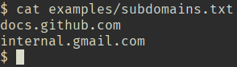
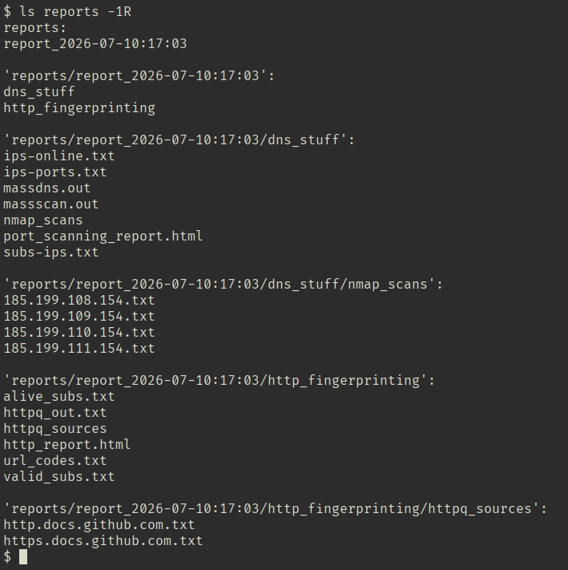

# Recon Automation Pipeline

A Bash-based reconnaissance automation pipeline that automates post-enumeration reconnaissance for bug bounty and penetration testing engagements.

The pipeline combines MassDNS, Masscan, Nmap, httprobe, and a modified version of httpq to generate organized HTML reports, reducing the manual effort required to correlate results from multiple reconnaissance tools.

It was developed to automate the repetitive DNS resolution, port scanning, service detection, and HTTP fingerprinting workflow commonly performed during bug bounty engagements.

---

## Features

- Automated DNS resolution
- Port discovery using Masscan
- Nmap service detection
- HTTP fingerprinting using a modified httpq
- HTML report generation
- Archived HTTP responses
- Timestamped report directories
- Single-command execution

---

## Workflow

```
                    Input Subdomains
                           │
                           ▼
                     MassDNS Resolution
                           │
                 (Resolvable hosts only)
                           │
                           ▼
                      Masscan Scan
                           │
                    Open Ports Found
                           │
                           ▼
                   Nmap Service Detection
                           │
                           ▼
               HTML Port Scanning Report
                           │
                           │
        ───────────────────┼───────────────────
                           │
                           ▼
               HTTP Service Discovery
                     (httprobe)
                           │
                     Alive URLs Only
                           │
                           ▼
            HTTP Fingerprinting (httpq)
                           │
          Save Source Code + Metadata
                           │
                           ▼
               HTML HTTP Report
```

For a detailed explanation of each stage and the design decisions behind the pipeline, see [docs/workflow.md](docs/workflow.md).

---

## Installation & Usage

### Install the following tools before running the pipeline:

- MassDNS
- Masscan
- Nmap
- httprobe
- Python 3

```bash
git clone https://github.com/soham23/recon-automation-pipeline.git
cd recon-automation-pipeline
./all_together.sh subdomains.txt
```
---

## Example Execution

### 1. Input

The pipeline expects a text file containing one subdomain per line.



### 2. Port Scanning Report

The generated port scanning report correlates resolved subdomains, IP addresses, open ports, and links to individual Nmap service scans.


### 3. HTTP Fingerprinting Report

The HTTP report summarizes reachable web applications, displaying their URLs, HTTP status codes, HTML titles, links to archived HTTP responses, and the corresponding port scanning results.


### 4. Generated Artifacts

Each execution creates a timestamped report directory containing all intermediate outputs, archived HTTP responses, and generated HTML reports.



---
## Documentation

- [Reconnaissance Workflow](docs/workflow.md)
- [Modified httpq](docs/modified-httpq.md)

---
## Limitations

* Linux only (tested on Linux)
* Requires third-party reconnaissance tools to be installed
* Does not perform subdomain enumeration
* Does not perform vulnerability detection
* Sequential execution with no resume support
* Designed for reconnaissance rather than exploitation

---

## Future Improvements

The planned enhancement is integrated subdomain enumeration, allowing users to supply a root domain and execute the complete reconnaissance workflow with a single command.

---

## Acknowledgements

- **httpq**
- **Trickest Resolvers**

For details about the bundled modified version of `httpq`, see [docs/modified-httpq.md](docs/modified-httpq.md).

---

## License

This project is licensed under the MIT License.

See the [LICENSE](LICENSE) file for details.