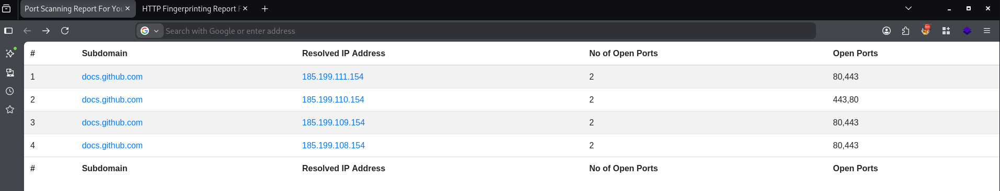
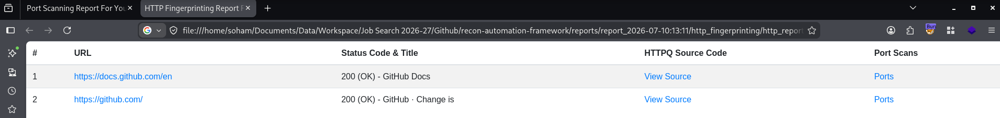

# Recon Automation Pipeline

A Bash-based reconnaissance automation pipeline that automates post-enumeration reconnaissance for bug bounty and penetration testing engagements.

The pipeline combines MassDNS, Masscan, Nmap, httprobe, and a modified version of httpq to generate organized HTML reports and preserve scan artifacts for future analysis.

---

## Features

- Automated DNS resolution
- Fast port discovery
- Nmap service detection
- HTTP fingerprinting
- HTML report generation
- Archived HTTP responses
- Timestamped report directories
- Single-command execution

---

## Why I Built This

During bug bounty engagements, I repeatedly performed the same sequence of DNS resolution, port scanning, service detection, and HTTP fingerprinting. While the individual tools were effective, reviewing and correlating their outputs manually became repetitive and time-consuming.

This project automates that workflow into a single command, generates readable HTML reports, and archives HTTP responses for future analysis.

---

## Workflow

```
                    Input Subdomains
                           │
                           ▼
                     MassDNS Resolution
                           │
                 (Resolvable hosts only)
                           │
                           ▼
                      Masscan Scan
                           │
                    Open Ports Found
                           │
                           ▼
                   Nmap Service Detection
                           │
                           ▼
               HTML Port Scanning Report
                           │
                           │
        ───────────────────┼───────────────────
                           │
                           ▼
               HTTP Service Discovery
                     (httprobe)
                           │
                     Alive URLs Only
                           │
                           ▼
            HTTP Fingerprinting (httpq)
                           │
          Save Source Code + Metadata
                           │
                           ▼
               HTML HTTP Report
```

---

## Installation & Usage

### Prerequisites

- MassDNS
- Masscan
- Nmap
- httprobe
- Python 3

```bash
git clone https://github.com/soham23/recon-automation-pipeline.git
cd recon-automation-pipeline
./all_together.sh subdomains.txt
```
---

## Generated Reports

Each execution creates a timestamped report directory inside `reports/`.

```
reports/
└── report_<timestamp>/
    ├── dns_stuff/
    └── http_fingerprinting/
```

### Port Scanning Report

The generated HTML report includes:

* IP Address
* Corresponding Subdomain
* Open Ports
* Number of Open Ports
* Individual Nmap scans

---

### HTTP Report

The generated HTTP report includes:

* Alive URL
* HTTP Status Code
* HTML Title
* Saved HTTP response source code

---

## Screenshots

### Port Scanning Report



### HTTP Fingerprinting Report



---

## Core Technologies

* Bash
* Python
* MassDNS
* Masscan
* Nmap
* httprobe
* httpq (modified)

## Limitations

* Linux only (tested on Linux)
* Requires third-party reconnaissance tools to be installed
* Does not perform subdomain enumeration
* Does not perform vulnerability detection
* Sequential execution with no resume support
* Designed for reconnaissance rather than exploitation

---

## Future Improvements

The planned enhancement is integrated subdomain enumeration, allowing users to supply a root domain and execute the complete reconnaissance workflow with a single command.

---

## Acknowledgements

- **httpq** – Bundles a modified version of the original project. The Apache 2.0 license is preserved in `httpq/`.
- **Trickest Resolvers** – `wordlists/resolvers-trusted.txt` is sourced from the Trickest Resolvers project (MIT License).

---

## License

This project is licensed under the MIT License.

See the [LICENSE](LICENSE) file for details.